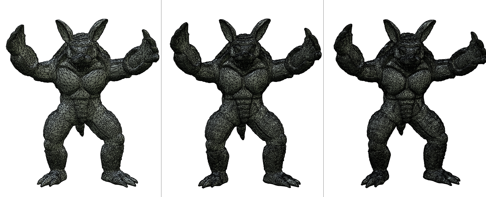
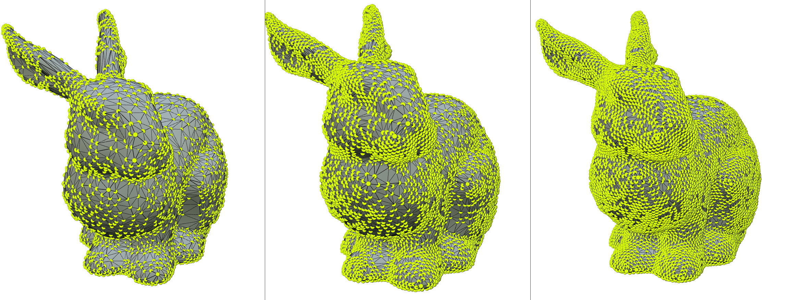
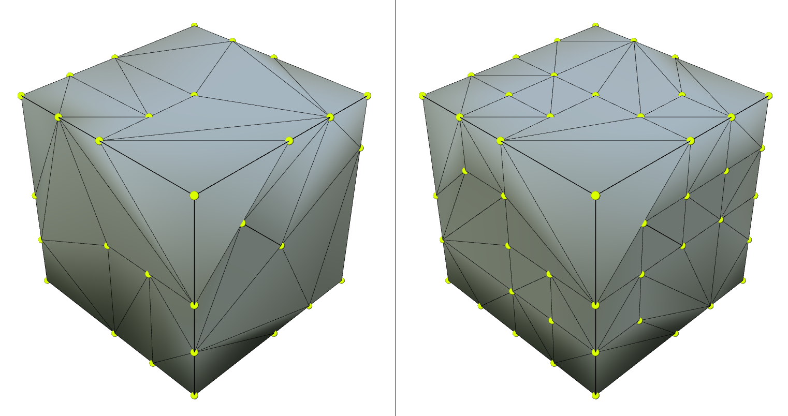
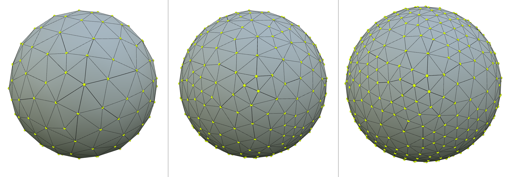
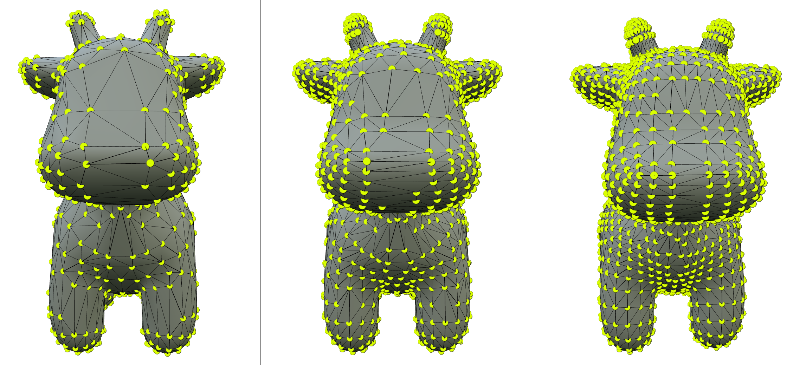
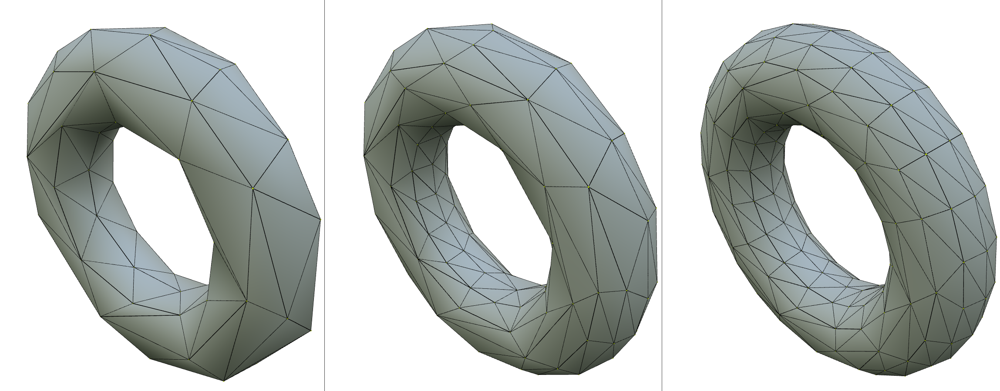

# Project-2: Mesh Simplification

这是国科大计算机图形学课程的第二个作业，本次作业我们将目光放在几何处理上，实现最基本的QEM网格简化算法。

---

## 运行环境与运行命令

- 批处理脚本：run.sh
- 可执行程序：simplify.exe
- 本地测试环境示例：WSL / Ubuntu 24.04，g++ 13.3.0
- OBJ可视化扩展：使用VSCode的mesh-viewer扩展
- Windows本地运行：需要同目录下的 <span style="background-color: lightgray;"> libstdc++-6.dll</span> /  <span style="background-color: lightgray;">libgcc_s_seh-1.dll </span>/  <span style="background-color: lightgray;">libwinpthread-1.dll </span> 文件
- 运行命令：
```
cd path-to-Homework2
chmod +x run.sh
./run.sh
```
> 说明： run.sh 只负责批量调用 simplify，不负责编译。在首次运行前，需自行编译，并确保可执行文件<span style="background-color: lightgray;">simplify.exe</span>已经位于项目根目录（与<span style="background-color: lightgray;">run.sh</span>同级）。


---

## 框架目录说明

```
Homework2/
├─ .vscode/                  # VSCode 配置
├─ assets/                   # 输入模型（.obj）
├─ external/                 # 第三方依赖/外部库（随框架提供）
├─ meshark/                  # 网格处理核心
├─ output/                   # 输出目录：简化后的 .obj 文件（按模型名分文件夹）
├─ picture/                  # 结果展示图片：同一模型在 r25/r50/r75 的对比截图
├─ .gitignore
├─ CMakeLists.txt            # CMake 构建入口
├─ README.md                 # 项目说明文档
├─ run.sh                    # 批处理脚本：对 assets 下所有模型生成 r25/r50/r75 输出到 output/
├─ simplify.exe              # 可执行程序（评测/本地运行入口）
├─ libgcc_s_seh-1.dll        # Windows 运行依赖（若在 Windows 下运行 simplify.exe 需要）
├─ libstdc++-6.dll           # Windows 运行依赖
└─ libwinpthread-1.dll       # Windows 运行依赖
```

---

## 相关结果展示













> 说明： 线条数目 = 原始线条数目 * 简化率 。
> 从对比图片可以清晰地发现，简化率越低，细节丢失越多,但整体上仍保留了物体特征。

---

## 算法与实现要点（QEM Mesh Simplification）

本作业实现了经典的 QEM（Quadric Error Metric）边坍缩网格简化流程，并基于框架提供的轻量半边表进行拓扑维护。整体流程为：
- 为每个顶点累计 quadric 矩阵 Q
- 为每条边计算最优坍缩位置与误差代价 cost
- 使用 multimap 维护“代价 -> 边”的优先结构，循环选择最小代价边进行坍缩
- 每次坍缩后，仅对局部邻域重新计算 Q 与边代价并更新优先结构

本实现未做任何选做题：不额外处理边界（boundary）网格、法线翻转约束、非流形修复、纹理/法线/颜色等属性插值等扩展。

---

### 1. 半边表遍历
本实验大量依赖的遍历。框架中顶点 VertexElement 提供 outgoingHalfEdges() ，遍历从该顶点出发的所有半边。
我们在 mesh-elements.h 的 TODO 中补全了 OutgoingHalfEdgeRange::Iterator::operator++：
- 对于当前从 v 出发的半边 h（h.tail == v），下一个绕 v 的出边为：h = h.twin.next
- 当迭代回到起始 halfedge（start）时停止（将 it 置空表示 end）
这样可以稳定获得顶点一环邻域的所有出边/邻点/相邻面。

---

### 2. 顶点 Quadric 矩阵 Q 的计算
对每个顶点 v，累加其相邻面片的平面 quadric：
1) 遍历 v 的所有 outgoingHalfEdges()，对每条半边 h 取其所属面 f = h.face
2) 获取面法线 n = normal(f) 并归一化
3) 以顶点位置 p_v = pos(v) 构造平面方程：n·x + d = 0，其中 d = -n·p_v
4) 将平面写成 4D 向量 plane = (a,b,c,d) = (n.x, n.y, n.z, d)
5) 该平面的 quadric 为 outerProduct(plane, plane)，并对所有相邻面累加：Q(v) = Σ plane * plane^T

注意：这里使用的是标准 QEM 的“平面外积累计”方式。框架的 setVertexPos() 会自动更新相邻面法线，因此每次局部更新位置后再重算 Q 即可。

---

### 3. 边的最优坍缩位置与代价
对边 e=(v0,v1)，先合并 quadric：Qbar = Q(v0) + Q(v1)。

**最优位置：**
- 取 Qbar 的左上角 3×3 为 A，取第 4 列前三项为 b（实现里用 glm::mat3(Qbar) 与 glm::vec3(Qbar[3])）。
- 解线性系统：A * x = -b，得到 x=(x,y,z) 作为最优坍缩位置。
- 若 A 不可逆（det 小于阈值 eps），采用退化策略：在 {p0=pos(v0), p1=pos(v1), pm=(p0+p1)/2} 中选取代价最小的位置作为最优位置。

**代价定义：**
- 令齐次坐标 hp = (x,y,z,1)，代价 cost(e) = hp^T * Qbar * hp。
- 实现中先算 p = computeOptimalCollapsePosition(e)，再计算 dot(hp, Qbar*hp) 得到 Real cost。

---

### 4. 最小代价边选择与主循环
初始化：
- 对所有顶点计算 Q(v)
- 对所有边计算 edge_collapse_cost(e)，并插入 cost_edge_map（std::multimap<Real, Edge>）

主循环（runSimplify(alpha)）：
- 当 mesh.numEdges() > alpha * num_original_edges 时，持续进行坍缩
- 每轮从 cost_edge_map 取 begin() 的边作为当前最小代价边

collapseMinCostEdge() 的逻辑：
1) 取 min_cost_edge = cost_edge_map.begin()->second
2) 若 mesh.isCollapsable(min_cost_edge) 为 false：
   - 将该边从 cost_edge_map 中移除（eraseEdgeMapping），并返回失败，让外层把其代价更新为 infinity 后跳过
3) 若可坍缩：
   - 计算最优位置 opt_pos = computeOptimalCollapsePosition(min_cost_edge)
   - 执行 v = collapseEdge(min_cost_edge) 完成拓扑坍缩
   - 调用 updateVertexPos(v, opt_pos) 完成位置更新与局部代价更新

---

### 5. 边坍缩拓扑更新
本实现针对“内部边 + 两侧均为三角形面”的典型情况进行坍缩，核心目标是：保留 v0（边的 tail），删除 v1（边的 tip），并将 v1 相关的拓扑与数据合并到 v0。

**(1) 需要访问/修改的局部元素（两侧三角形）：**
- 目标边 e01 的半边对：h01 = e.halfEdge()，h10 = h01.twin
- 两侧面：f0 = h01.face，f1 = h10.face
- f0 上另外两条半边：h12 = h01.next，h20 = h12.next
- f1 上另外两条半边：h03 = h10.next，h31 = h03.next
- 相关顶点：v0=h01.tail（保留），v1=h01.tip（删除），v2=h12.tip，v3=h03.tip
- 相关边：e01(删除)，e12(删除)，e31(删除)，e20(保留)，e03(保留)

**(2) 重定向 v1 的出边到 v0：**
- 先把 v1.outgoingHalfEdges() 收集到数组 outgoing_v1（避免遍历时被修改影响）
- 对其中除去与坍缩直接相关的半边（h10/h12）外，统一执行：
  - h.tail = v0
  - 同时令 h.twin.tip = v0（保持对偶半边指向一致）

**(3) 合并重复边（缝合 twin 关系）：**
坍缩后会产生两对潜在重复边： (v0,v2) 与 (v1,v2)、(v0,v3) 与 (v1,v3)。
- 在 v2 周围：用 h02 = h20.twin（v0->v2） 与 h21 = h12.twin（v2->v1，需改为 v2->v0）缝合
  - 先将 h21.tip 设为 v0
  - 令 h02.twin = h21，h21.twin = h02，并将两者 edge 统一设为 e20
  - 更新 e20.halfEdge() 指向一个有效 halfedge（实现中设为 h02）
- 在 v3 周围：用 h30 = h03.twin（v3->v0） 与 h13 = h31.twin（v1->v3，需改为 v0->v3）缝合
  - 将 h13.tail 设为 v0
  - 令 h13.twin = h30，h30.twin = h13，并将两者 edge 统一设为 e03
  - 更新 e03.halfEdge() 指向一个有效 halfedge（实现中设为 h13）

**(4) 修正顶点的 halfEdge 指针：**
- v0.halfEdge() 指向一个仍然存在且从 v0 出发的 halfedge（实现中设为 h02）
- 若 v2.halfEdge() 或 v3.halfEdge() 恰好指向即将删除的半边，则改为指向保留下来的半边（如 h21/h30）

**(5) 删除元素与同步删除附加数据：**
删除顺序很关键，避免悬空引用与 EdgeData/VertexData 索引错位：
1) 删除顶点 v1 前，先执行 Q.removeVertexData(v1) 清理其 quadric 数据
2) 删除两侧面 f0/f1
3) 删除将消失的 3 条边 e01/e12/e31：
   - 先 eraseEdgeMapping(ed) 从 cost_edge_map 去掉映射
   - 再 edge_collapse_cost.removeEdgeData(ed) 同步删除 EdgeData
   - 最后 mesh.removeEdge(ed) 删除边本体
4) 删除 6 条半边：h01/h10/h12/h20/h03/h31
5) 最后 mesh.removeVertex(v1) 删除顶点

collapseEdge() 返回保留下来的顶点 v0，供后续 updateVertexPos() 在该顶点处放置最优坍缩位置。

---

### 6. 局部更新策略
坍缩完成后，仅更新局部邻域以维持效率：
1) mesh.setVertexPos(v, pos)：更新顶点位置并由框架自动更新相关面法线
2) 收集受影响顶点 affected_vertices：
   - 首先包含 v 本身
   - 对 v 的每条 outgoingHalfEdge h：加入 h.tip
   - 对 h.face 的边界环（boundaryHalfEdges）遍历，将该面上的顶点（fh.tip）加入
   - 使用 push_unique 去重，避免重复计算
3) 对 affected_vertices 中每个顶点 u：重新计算 Q(u)=computeQuadricMatrix(u)
4) 收集受影响边 affected_edges：遍历每个受影响顶点 u 的 outgoingHalfEdges，将 h.edge 加入并去重
5) 对 affected_edges 中每条边 e：重新计算 new_cost=computeEdgeCost(e)，并调用 updateEdgeCost(e, new_cost) 更新 EdgeData 与 multimap 映射

该策略能保证每次坍缩只更新一环邻域内的 Q 与 cost，而不需要全局重算，从而满足批处理脚本对多个模型进行 r25/r50/r75 简化时的效率要求。