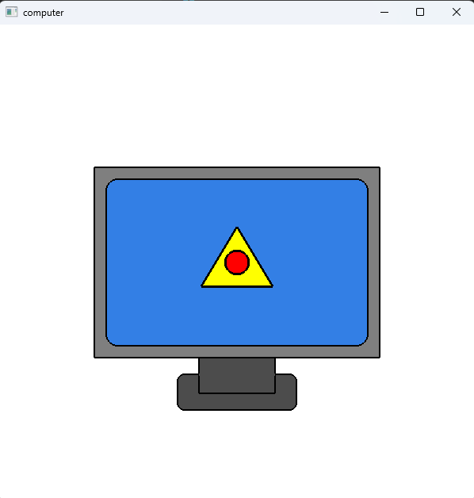

# 任务二：区域填充（小电脑图案升级版）

本项目是在 **任务一（t1_line_circle）线框版小电脑图案** 的基础上，  
实现了 **颜色区域填充、黑色轮廓保持、支架线段处理** 等增强功能。

最终效果如下：

（示例）


---

## 1. 开发与运行环境

- **操作系统**：Windows 11  
- **编译器**：MSYS2 UCRT64 下的 g++（x86_64-w64-mingw32）  
- **图形库**：OpenGL + freeglut  
- **开发工具**：VS Code  

环境安装示例：

```bash
pacman -S mingw-w64-ucrt-x86_64-gcc
pacman -S mingw-w64-ucrt-x86_64-freeglut
```

## 2. 文件说明

项目包含以下文件：

  t2_region_fill/
  │
  ├── main.c           # 程序入口
  ├── draw.c           # 图形绘制：直线、三角形、矩形、圆角矩形、圆弧等
  ├── draw.h
  │
  ├── color.c          # 新增：预定义颜色 + setColor 颜色工具
  ├── color.h
  │
  ├── Makefile         # mingw32-make 编译配置
  ├── build.bat        # Windows 一键编译
  │
  └── computer.png     # 程序运行截图

## 3. 本任务相比 t1（线框图）新增/修改的内容

1. 新增颜色模块 color.h / color.c

2. 所有图形改为“先填充，再描边”

3. Makefile 更新：增加 color.c 编译

## 4. 编译与运行方法

同task1

